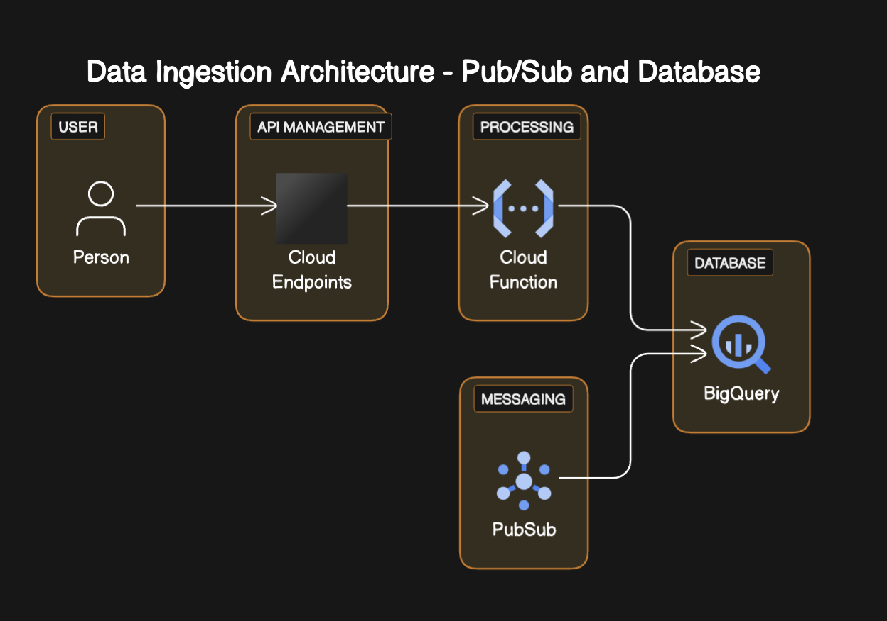

# DevSecOps-Challenge
En primer lugar pido disculpas y quiero ser sincero comentando que no le he podido dedicar el tiempo necesario para completar el challenge, ha sido una semana particularmente complicada por temas personales y se me ha complicado muchisimo encontrar un momento donde enfocarme, creo que no he podido dedicarle mas de 8 hs reales. 
Por otro lado mi falta de conocimiento y experiencia en varios aspectos complicaron la solucion.
Mas alla de estos impedimentos estoy totalmente agradecido por la oportunidad y quise por lo menos compartir el poco avance de lo que he podido realizar.
Nuevamente pido disculpas.

## Objetivo
Desarrollar un sistema en la nube para ingestar, almacenar y exponer datos mediante el uso de IaC y despliegue con flujos CI/CD. Hacer pruebas de calidad, monitoreo y alertas para asegurar y monitorear la salud del sistema.

Se creó una service account en GCP la cual se utilizara para desplegar los servicios. Una buena practica seria utilizar diferentes service account para cada recurso desplegado en la nube.

### Parte 1: Infraestructura e IaC

Ingesta de Datos:
Dependiendo el origen y como son entregados los datos se puede ajustar mejor como realizar la ingesta de los mismos.
Las opciones de entrega de datos y el servicio utilizado podrian ser las siguientes:

Streaming:

En la ingesta de datos por streaming, los datos se envían continuamente a medida que son generados, permitiendo un procesamiento en tiempo real.
Este enfoque es ideal para casos en los que se requiere análisis inmediato o reacción en tiempo real a los eventos.
Servicios de GCP:

Cloud Pub/Sub: Utiliza Google Cloud Pub/Sub para establecer un flujo de datos en tiempo real. Los productores envían mensajes a un tema, y los consumidores los reciben en suscripciones. Puedes utilizar Cloud Dataflow para procesar estos mensajes en tiempo real.

Publicación y Suscripción:

La publicación y suscripción es un modelo de envío de mensajes en el que los productores publican mensajes en un "tema", y los consumidores se suscriben a esos temas para recibir los mensajes. Este enfoque es eficaz para manejar eventos o mensajes de manera asíncrona.

Servicios de GCP:
Cloud Pub/Sub: Utiliza Cloud Pub/Sub para implementar el modelo de publicación y suscripción. Los productores publican mensajes en temas, y los consumidores se suscriben a esos temas para recibir los mensajes.

Eventos (por ejemplo, cuando se sube un archivo a un bucket):

En este enfoque, la ingesta de datos se desencadena por eventos específicos, como la creación o modificación de archivos en un bucket de Cloud Storage. Es útil cuando los datos se generan como archivos y se almacenan en un sistema de almacenamiento.

Servicios de GCP:
Cloud Storage y Cloud Functions: Configura un desencadenador de Cloud Functions para responder a eventos específicos en Cloud Storage, como la creación o modificación de archivos. Cuando un archivo se carga en el bucket, el Cloud Function se activa y puede realizar acciones como enviar el contenido a otros servicios de GCP.

En resumen, la elección entre streaming, publicación y suscripción, o eventos depende de la naturaleza de los datos y los requisitos de la aplicación. Cloud Pub/Sub es una herramienta clave para gestionar la ingesta y distribución de datos en todos estos casos. Se puede combinar estos enfoques según las necesidades específicas del proyecto.

En este caso se ha pensado en buscar una solucion simple y ligera simulando la ingesta de datos en una funcion cloud functions, sin tener que configurar un cluster de Kafka, sino utilizando una biblioteca para simular eventos de pub/sub en Python.

1. a. Se ha utilizado Cloud Functions para la simulacion de ingesta de datos. INCOMPLETO
    Se uso 'kafka-python', una biblioteca de Kafka para Python que nos permite emular un broker de Kafka sin necesidad de configurar un cluster completo.
    He intentando dejarla funcional pero tengo problemas con el codigo que no me dio el tiempo a resolverlo. La funcion se creo pero no quedo funcional, enfrente algunos problemas de dependencias que fueron solucionados sin embargo crashea al momento de simular la generacion de datos. No tengo en claro el codigo y he tomado uno de ejemplo de internet, deberia debuggearlo y ver que no compila.
   
   b. Se utilizara BigQuery para almacenar los datos ingresados.
   Se debe crear una base de datos Bigquery que se utilizara para almacenar los datos.

   c. Cloud Run expondra una API HTTP que entregara los datos almacenados en BigQuery.
   
   d. Todo esto se despliega mediante Terraform como IaC.
   Se agregaron archivos con modulos para cada uno de los recursos.

### Parte 2: Aplicaciones y flujo CI/CD
#### 1. API HTTP: Levantar un endpoint HTTP con lógica que lea datos de base de datos y los exponga al recibir una petición GET

Probaria utilizar Cloud Endpoints para crear y gestionar el endpoint API HTTP. 

#### 2. Deployar API HTTP en la nube mediante CI/CD a tu elección. Flujo CI/CD y ejecuciones deben estar visibles en el repositorio git.

Configuraria un flujo de Integración Continua / Despliegue Continuo (CI/CD) utilizando Cloud Build. Cada vez que se realice un cambio en el repositorio Git, Cloud Build automáticamente compilará y desplegará la nueva versión de la API en GCP.

#### 3. (Opcional) Ingesta: Agregar suscripción al sistema Pub/Sub con lógica para ingresar los datos recibidos a la base de datos. El objetivo es que los mensajes recibidos en un tópico se guarden en la base de datos. No requiere CI/CD.

#### 4. Incluye un diagrama de arquitectura con la infraestructura del punto 1.1 y su interacción con los servicios/aplicaciones que demuestra el proceso end-to-end de
ingesta hasta el consumo por la API HTTP

Diagrama generado con IA (debido al poco tiempo sino lo haria con herramientas como draw.io o lucidchart)

### Parte 3: Pruebas de Integración y Puntos Críticos de Calidad
#### 1. Implementa en el flujo CI/CD en test de integración que verifique que la API efectivamente está exponiendo los datos de la base de datos. Argumenta.

En el proceso de implementación de pruebas de integración en nuestro flujo de CI/CD, adoptaremos una estrategia fundamental para verificar la efectiva exposición de datos de la base de datos a través de nuestra API en Google Cloud Platform (GCP). Para llevar a cabo esta tarea, aprovecharemos herramientas esenciales, como Cloud Build, que automatizará no solo nuestras pruebas sino también los despliegues. Además, enfocaremos nuestras pruebas de integración específicamente en Cloud Functions, garantizando la validación exhaustiva de la funcionalidad de la API. Los pasos subsiguientes implican el desarrollo de pruebas en un entorno controlado que emule las solicitudes reales a nuestra API y la configuración de Cloud Build para ejecutar estas pruebas de manera automática con cada implementación. En última instancia, subrayaremos la eficacia de estas pruebas al resaltar cómo aseguran de manera sólida el correcto funcionamiento de la API al interactuar con los datos almacenados en la base de datos.

#### 2. Proponer otras pruebas de integración que validen que el sistema está funcionando correctamente y cómo se implementarían.

Queremos asegurar el funcionamiento óptimo del sistema, por eso se necesitan pruebas adicionales de integración más allá de las mencionadas anteriormente. Estas pruebas se podrian centran en dos aspectos cruciales: rendimiento y seguridad.

Para evaluar el rendimiento del sistema, nos apoyaremos en Cloud Monitoring, una herramienta poderosa que nos permitirá medir y analizar la eficiencia de la API en condiciones de carga variable. Adicionalmente, implementar pruebas de carga simulando situaciones de alto tráfico nos proporciona una evaluación completa de la capacidad de respuesta del sistema ante demandas exigentes.

En cuanto a seguridad de acuerdo a informacion encontrada se puede utilizar Cloud Security Scanner para llevar a cabo búsquedas exhaustivas de posibles vulnerabilidades en el sistema. Además, desplegar pruebas de seguridad en las capas de la API y la base de datos, asegurando así la proteccion de datos sensibles. Estas medidas combinadas fortalecerán la integridad y la resistencia del sistema ante desafíos tanto de rendimiento como de seguridad.

#### 3. Identificar posibles puntos críticos del sistema (a nivel de fallo o performance) diferentes al punto anterior y proponer formas de testearlos o medirlos (no implementar)

Al intentar identificar puntos críticos del sistema, podemos abordar posibles áreas de vulnerabilidad, tanto en términos de fallo como de rendimiento.

Al enfrentarnos al punto crítico de posible sobrecarga de tráfico, implementar pruebas de estrés utilizando herramientas como Apache JMeter podria ser una opcion. Estas pruebas van a permitir una evaluación exhaustiva de cómo el sistema maneja cargas extremas, proporcionando valiosa información sobre su capacidad y robustez frente a situaciones de alta demanda.

Otro punto crítico que se podria abordar es el tiempo de respuesta del sistema. Utilizando Cloud Monitoring para medir con precisión el tiempo de respuesta de la API, se pueden establecer umbrales aceptables para garantizar que el sistema responda eficientemente, asegurando así una experiencia de usuario óptima.

Este enfoque integral en identificar y mitigar puntos críticos fortalece la fiabilidad y rendimiento del sistema en diversos escenarios.

#### 4. Proponer cómo robustecer técnicamente el sistema para compensar o solucionar dichos puntos críticos

En base a documentacion encontrda en Google para mejorar la robustez del sistema y manejar sus puntos críticos, se podria realizar lo siguiente:

Escalabilidad Automática con GKE: Utilizar GKE para orquestacion de contenedores, permitiendo una escalabilidad automática según la demanda.

Caché de Datos con Cloud Memorystore: Implementaremos un sistema de caché para almacenar datos frecuentemente accedidos, reduciendo así la carga en la base de datos y mejorando los tiempos de respuesta.

Monitoreo Continuo con Cloud Monitoring: Configurar alertas para recibir notificaciones proactivas sobre cualquier anomalía en el rendimiento o el uso de recursos, permitiendo una intervención rápida.

Estas propuestas combinadas fortalecerán la calidad y la resistencia del sistema, asegurando un rendimiento óptimo incluso en condiciones desafiantes y proporcionando una experiencia de usuario excepcional.

### Parte 4: Métricas y Monitoreo
#### 1. Proponer 3 métricas (además de las básicas CPU/RAM/DISK USAGE) críticas para entender la salud y rendimiento del sistema end-to-end

Además de las métricas básicas podriamos enfocarnos en:

Latencia del Sistema: Mide el tiempo que tarda el sistema en responder a una solicitud, siendo crucial para evaluar la experiencia del usuario.
Tasa de Errores: Evalúa la frecuencia de errores en las operaciones, permitiendo identificar posibles problemas en la lógica de la aplicación.
Recuento de Solicitudes por Segundo: Proporciona una visión general de la carga del sistema y ayuda a anticipar picos de demanda.

#### 2. Proponer una herramienta de visualización y describe textualmente qué métricas mostraría, y cómo esta información nos permitiría entender la salud del sistema para
tomar decisiones estratégicas

Se podria utilizar Grafana. La herramienta mostraría gráficos interactivos de tendencias temporales para cada métrica crítica. Por ejemplo, un panel dedicado a la latencia del sistema permitiría identificar patrones de rendimiento y nos brindaría una visión clara de la salud del sistema para facilitar la toma de decisiones estratégicas.

#### 3. Describe a grandes rasgos cómo sería la implementación de esta herramienta en la nube y cómo esta recolectaría las métricas del sistema

La implementación se realizaría utilizando servicios como Prometheus para la recopilación de métricas y Grafana para la visualización. Estos servicios se desplegarían como contenedores en un clúster gestionado, como GKE. Prometheus se configuraría para recopilar métricas de cada instancia del sistema, y Grafana se integraría para proporcionar paneles de control intuitivos y personalizables.

#### 4. Describe cómo cambiará la visualización si escalamos la solución a 50 sistemas similares y qué otras métricas o formas de visualización nos permite desbloquear
este escalamiento.

Al escalar a 50 sistemas similares, la visualización deberá adaptarse. Se agregarían paneles específicos para mostrar métricas agregadas y comparativas entre instancias. Además, se podrían incluir métricas adicionales como la distribución de carga entre los sistemas para entender mejor el rendimiento colectivo.

#### 5. Comenta qué dificultades o limitaciones podrían surgir a nivel de observabilidad de los sistemas de no abordarse correctamente el problema de escalabilidad

Sin abordar adecuadamente la escalabilidad, podríamos enfrentar desafíos en la recopilación y visualización eficiente de datos. Las herramientas de monitoreo podrían experimentar latencia al tratar de manejar la carga generada por múltiples sistemas, lo que dificultaría una observabilidad efectiva. Además, la falta de escalabilidad podría limitar la capacidad para identificar patrones de rendimiento en entornos altamente dinámicos. Es crucial abordar estas limitaciones para garantizar una observabilidad efectiva a medida que la infraestructura crece.

### Parte 5: Alertas y SRE (Opcional)

#### 1. Define específicamente qué reglas o umbrales utilizarías para las métricas propuestas, de manera que se disparan alertas al equipo al decaer la performance del sistema. Argumenta.

Reglas y Umbrales para Alertas de Performance:
Para las métricas propuestas:

Latencia del Sistema: Estableceríamos un umbral para alertas en caso de que la latencia supere un tiempo específico, indicando posibles problemas de rendimiento.
Tasa de Errores: Configuraríamos alertas al superar un porcentaje definido de errores en las operaciones, señalando posibles fallos en la lógica del sistema.
Recuento de Solicitudes por Segundo: Establecer alertas en caso de picos inesperados que podrían indicar una carga anormal.

Estos umbrales se basan en un equilibrio entre mantener un rendimiento óptimo y detectar problemas antes de que afecten la experiencia del usuario. Alertar al equipo cuando se exceden estos umbrales permite una respuesta proactiva, mitigando posibles impactos negativos en la calidad del servicio.

#### 2. SLIs y SLOs para Servicios del Sistema:

SLI (Service Level Indicator): Utilizaríamos la latencia del sistema como SLI, ya que directamente afecta la experiencia del usuario.
SLO (Service Level Objective): Estableceríamos un objetivo de latencia del 95% de las solicitudes completadas en un tiempo determinado.

Elección del SLI: La latencia refleja directamente la percepción del usuario sobre el rendimiento del sistema.
SLO: Un objetivo del 95% equilibra la robustez del sistema y permite cierta variabilidad sin afectar significativamente la experiencia del usuario.